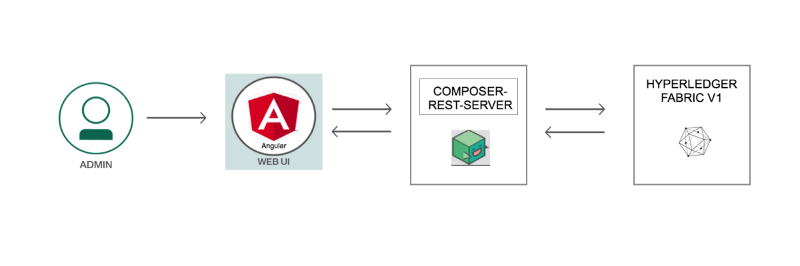
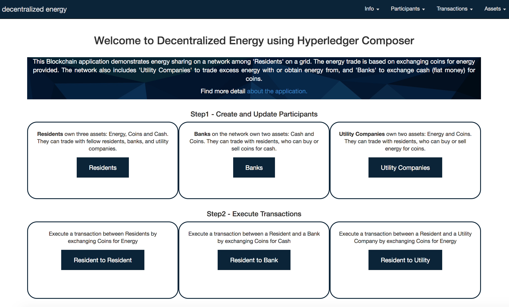

*阅读本文的其他语言版本：[English](README.md)。*
# 通过 Hyperledger Composer 实现去中心化能源

人们正在探索的一种关键的区块链应用是去中心化能源网络。这个想法源于一个街区，其中某些住户通过太阳能电池板或其他途径制造能源，而且能将过剩的能源销售给其他需要能源的住户。交易是基于每个住户帐户中的硬币进行的。根据预先确定的合约和价格，在一个特定的结算期内，从使用者那里取出资金，并将其存到生产者那里。每次交易都必须是原子性的，并添加到一个区块链账本中，以建立信任和执行验证。该网络可以包含银行，以便可以用硬币向银行换取法定货币（美元）。还可以包含电力公司，电力公司可以通过该网络购买或提供能源。

在本 Code Pattern 中，我们将使用 Hyperledger Composer 创建这样一个区块链应用程序。该网络由住户、银行和电力公司组成。住户可以彼此交换硬币来获取能源。  该应用程序设想了一个预付费系统，在该系统中，交易发生在使用能源和更新价值之后。  住户可以在该网络上与银行交换硬币来获取法定货币（美元）。  住户还可以在该网络上通过硬币向电力公司换取能源。

本 Code Pattern 适合希望开始通过 Hyperledger Composer 构建区块链应用程序的开发人员。读者完成本 Code Pattern 后，将会掌握如何：

* 使用 Hyperledge Composer 创建业务网络并在区块链账本上记录交易
* 将该网络部署到一个 Hyperledger Fabric 实例
* 构建一个 Angular 应用程序来通过 REST API 与该网络交互


# 架构流程

<p align="center">
  
</p>

1. 管理员与一个包含 Angular 框架的去中心化能源用户界面进行交互。
2. 应用程序通过 REST API 处理用户对网络的请求。
3. 向 Hyperledger Fabric V1 上的区块链状态数据库发出请求
4. 使用 REST API 检索数据库的状态
5. Angular 框架通过对 REST API 执行 GET 调用来获取数据

# 包含的组件

* Hyperledger Composer
* Angular 框架
* Loopback


# 运行应用程序
按照这些步骤来设置并运行本 Code Pattern。下面详细介绍了这些步骤。

## 前提条件
- 操作系统：Ubuntu Linux 14.04 / 16.04 LTS（均为 64 位）或 Mac OS 10.12
- [Docker](https://www.docker.com/)（17.03 或更高版本）
- [npm](https://www.npmjs.com/)  (v5.x)
- [Node](https://nodejs.org/en/)（8.9 或更高版本 - 请注意，不支持第 9 版）
  * 要安装特定的 Node 版本，可以使用 [nvm](https://davidwalsh.name/nvm)
- [Hyperledger Composer](https://hyperledger.github.io/composer/installing/development-tools.html)
  * 要安装 composer cli，请使用以下命令
    `npm install -g composer-cli`
  * 要安装 composer-rest-server，请使用以下命令
    `npm install -g composer-rest-server`
  * 要安装 generator-hyperledger-composer，请使用以下命令
    `npm install -g generator-hyperledger-composer`

## 步骤
1. [克隆存储库](#1-clone-the-repo)
2. [设置 Fabric](#2-setup-fabric)
3. [生成业务网络归档文件](#3-generate-the-business-network-archive)
4. [部署到 Fabric](#4-deploy-to-fabric)
5. [运行应用程序](#5-run-application)
6. [创建参与者](#6-create-participants)
7. [执行交易](#7-execute-transactions)

## 1. 克隆存储库

本地克隆 `Decentralized-Energy-Composer 代码`。在终端中，运行：

`git clone https://github.com/IBM/Decentralized-Energy-Composer`

## 2. 设置 Fabric

这些命令将停止并移除所有运行的容器，而且还会移除所有以前创建的 Hyperledger Fabric 链代码镜像：

```none
docker kill $(docker ps -q)
docker rm $(docker ps -aq)
docker rmi $(docker images dev-* -q)
```

所有脚本都在 `/fabric-tools` 目录中。  启动 fabric 并创建对等节点管理员卡：

```
cd fabric-tools/
./downloadFabric.sh
./startFabric.sh
./createPeerAdminCard.sh
```

## 3. 生成业务网络归档文件

接下来从根目录生成业务网络归档 (BNA) 文件：

```
cd ../
npm install
```

`package.json` 中的 `composer archive create` 命令已创建了一个名为 `decentralized-energy-network@0.1.15.bna` 的文件。


## 4. 部署到 Fabric

现在，我们已准备好将业务网络部署到 Hyperledger Fabric。这需要将 Hyperledger Composer 链代码安装在对等节点上，然后必须将业务网络归档文件 (.bna) 发送给该对等节点，还必须创建一个新参与者、身份和关联卡作为网络管理员。最后，必须导入网络管理员业务网络卡供使用，然后对该网络执行 ping 操作来检查它是否会响应。

首先，安装业务网络：

```
composer network install --card PeerAdmin@hlfv1 --archiveFile decentralized-energy-network@0.1.15.bna
```

启动业务网络：

```
composer network start --networkName decentralized-energy-network --networkVersion 0.1.15 --networkAdmin admin --networkAdminEnrollSecret adminpw --card PeerAdmin@hlfv1 --file networkadmin.card
```

导入网络管理员身份作为适用的业务网络卡：
```
composer card import --file networkadmin.card
```

检查业务网络是否已成功部署，运行以下命令对该网络执行 ping 操作：
```
composer network ping --card admin@decentralized-energy-network
```

## 5. 运行应用程序

首先，进入 `angular-app` 文件夹并安装依赖项：

```
cd ../angular-app/
npm install
```

要启动应用程序，请执行以下操作：
```
npm start
```

该应用程序现在应在以下位置运行：
`http://localhost:4200`

<div style='border: 2px solid #f00;'>
  
</div>
</br>

将与网络进行通信的 REST 服务器位于以下位置：
`http://localhost:3000/explorer/`


## 6. 创建参与者

打开应用程序后，创建参与者并填入虚拟数据。  创建住户、银行和电力公司。


## 7. 执行交易

在住户之间、住户与银行之间，以及住户与电力公司之间手动执行交易。  执行交易后，确保参与者帐户价值已更新。


在会话结束后，停止 Fabric：

```
cd ~/fabric-tools
./stopFabric.sh
./teardownFabric.sh
```

## 扩展 Code Pattern

这个应用程序演示了使用区块链的去中心化能源网络的基本概念，可通过多种方式对其进行扩展：
* 添加特定的权限和参与者访问权
* 设置参与者之间的实时交易
* 集成 IoT 来读取电表读数和分配能源

## 部署到 IBM Cloud

可以将区块链网络部署到 IBM Cloud。 
可以使用 [IBM Blockchain Platform](https://console.bluemix.net/catalog/services/blockchain) 并在 `Starter Membership Plan` 下免费开始部署。  遵循[这些指示信息](https://console.bluemix.net/docs/services/blockchain/develop_starter.html#deploying-a-business-network) 将业务网络部署到 IBM Blockchain Platform。

## 附加资源
* [Hyperledger Fabric 文档](http://hyperledger-fabric.readthedocs.io/en/latest/)
* [Hyperledger Composer 文档](https://hyperledger.github.io/composer/latest/introduction/introduction.html)

## 许可
[Apache 2.0](LICENSE)
