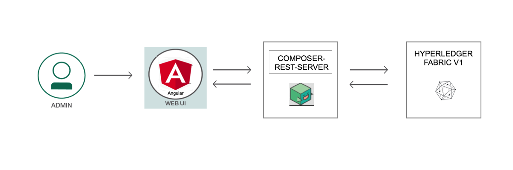
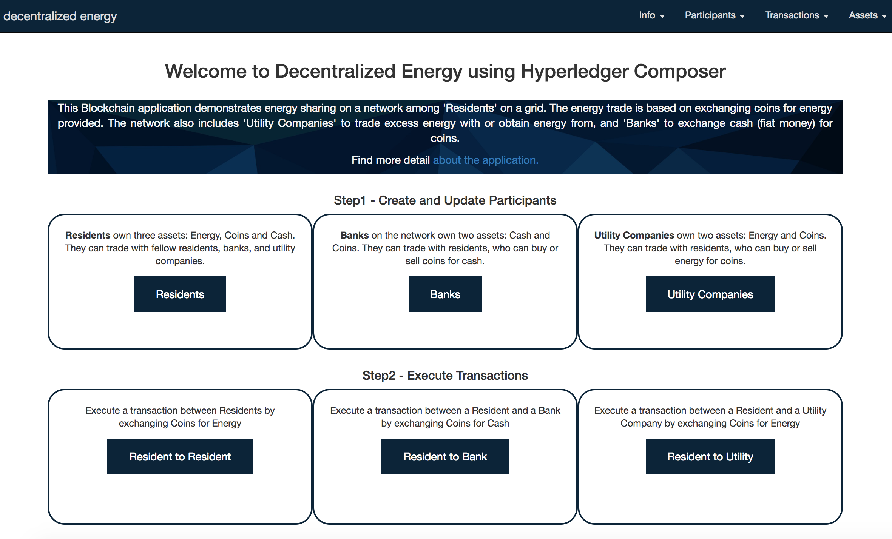

*Read this in other languages: [中国](README-cn.md).*
# Decentralized Energy with Hyperledger Composer

A key application of Blockchain being currently explored is a Decentralized Energy network. The idea stems from a neighborhood where certain Residents are producing energy through Solar panels or other means, and can sell excess energy to Residents needing energy. The transactions would be based on coins in each Resident's account. As per a pre-determined contract and rate, the coins would be debited from the consumer and credited to the producer, for a certain billing period. Each transaction would need to be atomic and added to a Blockchain ledger for trust and verification. The network can include Banks to transact coins for Fiat currency (USD). The network can have Utility Company who can buy or provide energy through the network.

In this developer journey, we will create such a Blockchain application using Hyperledger Composer. The network consists of Residents, Banks and Utility Companies. Residents can exchange coins for energy among each other.  The application assumes a pre-paid system where transactions occur after the energy is consumed and the values are updated.  The Resident can exchange coins for Fiat money (USD) with Banks on the network.  The Residents can also transact coins for energy with a Utility company on the network.

# Architecture Flow

<p align="center">
  
</p>

1. The administrator interacts with Decentralized Energy UI comprising of Angular framework
2. The application processes user requests to the network through a REST API.
3. Implements requests to the Blockchain state database on Hyperledger Fabric v1
4. The REST API is used to retrieve the state of the database
5. The Angular framework gets the data through GET calls to the REST API

# Included Components

* Hyperledger Composer
* Angular Framework
* Loopback


# Running the Application
Follow these steps to setup and run this developer journey. The steps are described in detail below.

## Prerequisite
- [Docker](https://www.docker.com/) (Version 17.03 or higher)
- [npm](https://www.npmjs.com/)  (v3.x or v5.x)
- [Node](https://nodejs.org/en/) (version 6.x - note version 7 is not supported)
  * to install Node v6.x you can use [nvm](https://davidwalsh.name/nvm)
- [Hyperledger Composer](https://hyperledger.github.io/composer/installing/development-tools.html)
  * to install composer cli
    `npm install -g composer-cli`
  * to install composer-rest-server
    `npm install -g composer-rest-server`
  * to install generator-hyperledger-composer
    `npm install -g generator-hyperledger-composer`

## Steps
1. [Clone the repo](#1-clone-the-repo)
2. [Setup Fabric](#2-setup-fabric)
3. [Generate the Business Network Archive](#3-generate-the-business-network-archive)
4. [Deploy to Fabric](#4-deploy-to-fabric)
5. [Run Application](#5-run-application)
6. [Create Participants](#6-create-participants)
7. [Execute Transactions](#7-execute-transactions)

## 1. Clone the repo

Clone the `Decentralized-Energy-Composer code` locally. In a terminal, run:

`git clone https://github.com/IBM/Decentralized-Energy-Composer`

## 2. Setup Fabric

These commands will kill and remove all running containers, and should remove all previously created Hyperledger Fabric chaincode images:

```none
docker kill $(docker ps -q)
docker rm $(docker ps -aq)
docker rmi $(docker images dev-* -q)
```

Set Hyperledger Fabric version to v1.0:

`export FABRIC_VERSION=hlfv1`

All the scripts will be in the directory `/fabric-tools`.  Start fabric and create peer admin card:

```
cd fabric-tools/
./downloadFabric.sh
./startFabric.sh
./createPeerAdminCard.sh
```

## 3. Generate the Business Network Archive

Next generate the Business Network Archive (BNA) file from the root directory:

```
cd ../
npm install
```

The `composer archive create` command in `package.json` has created a file called `decentralized-energy-network.bna` in the `dist` folder.


## 4. Deploy to Fabric

Now, we are ready to deploy the business network to Hyperledger Fabric. This requires the Hyperledger Composer chaincode to be installed on the peer,then the business network archive (.bna) must be sent to the peer, and a new participant, identity, and associated card must be created to be the network administrator. Finally, the network administrator business network card must be imported for use, and the network can then be pinged to check it is responding.

First, install the composer runtime:

```
cd dist/
composer runtime install --card PeerAdmin@hlfv1 --businessNetworkName decentralized-energy-network
```

Deploy the business network:

```
composer network start --card PeerAdmin@hlfv1 --networkAdmin admin --networkAdminEnrollSecret adminpw --archiveFile decentralized-energy-network.bna --file networkadmin.card
```

Import the network administrator identity as a usable business network card:
```
composer card import --file networkadmin.card
```

Check that the business network has been deployed successfully, run the following command to ping the network:
```
composer network ping --card admin@decentralized-energy-network
```

## 5. Run Application

First, go into the `angular-app` folder and install the dependency:

```
cd ../angular-app/
npm install
```

To start the application:
```
npm start
```

The application should now be running at:
`http://localhost:4200`

<div style='border: 2px solid #f00;'>
  
</div>
</br>

The REST server to communicate with network is available here:
`http://localhost:3000/explorer/`


## 6. Create Participants

Once the application opens, create participants and fill in dummy data.  Create Residents, Banks and Utility Companies.


## 7. Execute Transactions

Execute transactions manually between Residents, Resident and Bank, and Resident and Utility Company.  After executing transactions, ensure the participants account values are updated.


At the end of your session, stop fabric:

```
cd ~/fabric-tools
./stopFabric.sh
./teardownFabric.sh
```

# Extending Journey

This application demonstrates a basic idea of a decentralized energy network using Blockchain and can be expanded in several ways:
* Adding specific permissions and participant access
* Setting up real time transactions among participants
* Integrating with IoT to read from power meter and distribute energy


## Additional Resources
* [Hyperledger Fabric Docs](http://hyperledger-fabric.readthedocs.io/en/latest/)
* [Hyperledger Composer Docs](https://hyperledger.github.io/composer/introduction/introduction.html)

## License
[Apache 2.0](LICENSE)
